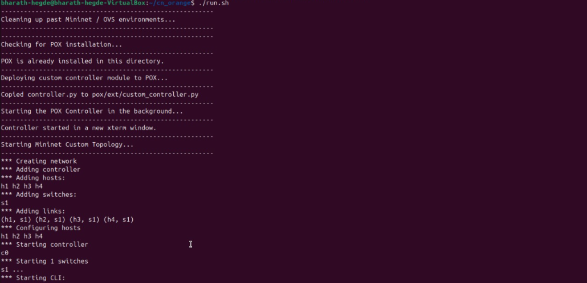
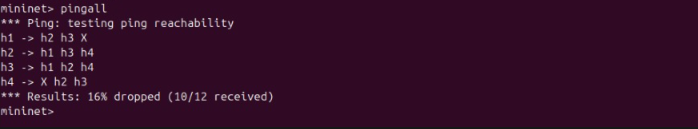
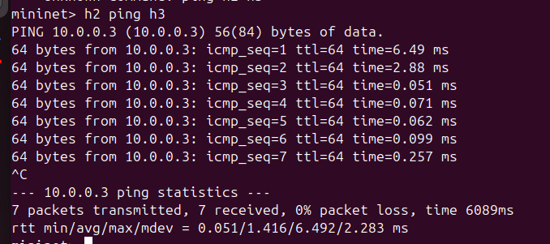
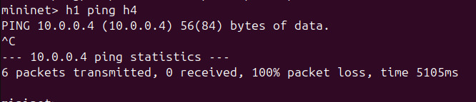
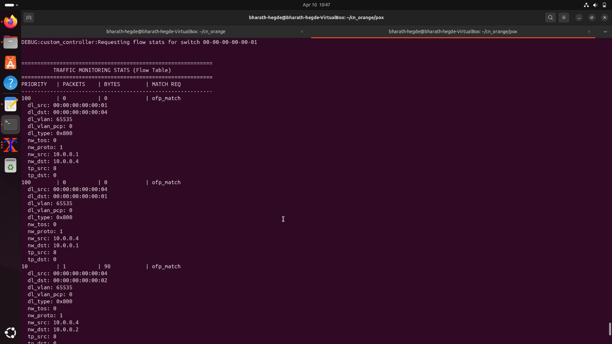
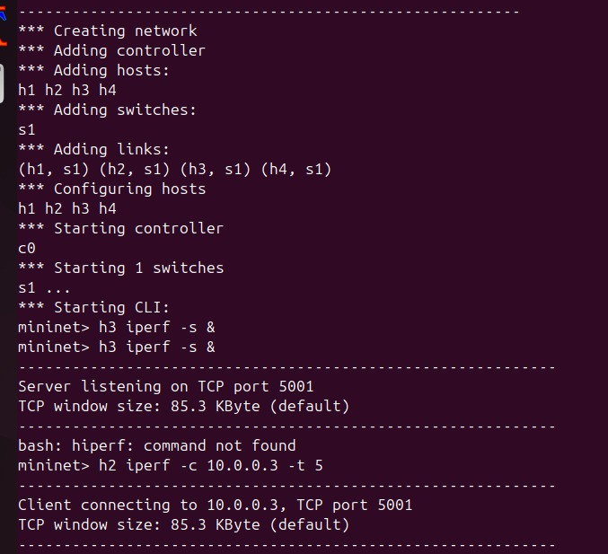
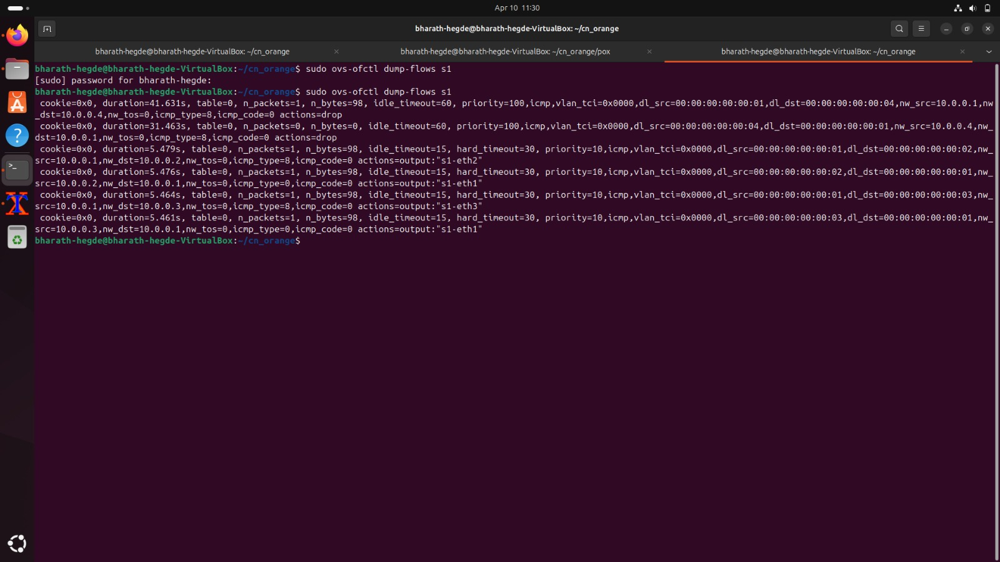

# SDN Project: POX Controller and Mininet Custom Topology

## Problem Statement

The objective of this project is to implement a complete Software Defined Networking (SDN) solution using Mininet and a POX controller. The system demonstrates controller–switch interaction, OpenFlow-based match–action rules, firewall-based traffic filtering, and traffic monitoring.

Key objectives:

* Create a custom Mininet topology
* Implement a POX controller with learning switch behavior
* Add firewall rules to block specific traffic (h1 ↔ h4)
* Monitor flow statistics and network behavior

---

## Prerequisites & Setup

```bash
sudo apt-get update
sudo apt-get install mininet git python3 xterm
```

Clone POX (if not already present):

```bash
git clone https://github.com/noxrepo/pox.git
```

---

## Execution Steps

```bash
chmod +x run.sh
./run.sh
```

This will:

1. Clean previous Mininet state
2. Copy controller to POX
3. Start POX controller
4. Launch Mininet topology

---

## Testing Scenarios

### Scenario 1: Firewall (Blocked Traffic)

```bash
mininet> pingall
```

Expected:

* h1 cannot reach h4
* h4 cannot reach h1
* ~16% packet loss

---

### Scenario 2: Allowed Traffic

```bash
mininet> h2 ping h3
```

Expected:

* Successful communication

---

### Scenario 3: Throughput Test

```bash
mininet> h3 iperf -s &
mininet> h2 iperf -c 10.0.0.3 -t 5
```

Expected:

* Bandwidth output in Mbits/sec

---

## Monitoring and Observations

### Controller Logs

* Shows packet_in events
* Firewall decisions (DROP)
* Flow statistics

### Flow Table

Run in separate terminal:

```bash
sudo ovs-ofctl dump-flows s1
```

Shows:

* Match fields (nw_src, nw_dst)
* Actions (output/drop)
* Packet counters

---

## Proof of Execution (Screenshots)

### 1. Topology Setup



Mininet topology with 4 hosts and POX controller running.

---

### 2. PingAll Result (Allowed + Blocked)



Shows:

* Allowed communication (h2, h3)
* Blocked communication (h1 ↔ h4)

---

### 3. Allowed Ping



Successful ping between h2 and h3.

---

### 4. Blocked Ping



Ping failure between h1 and h4 due to firewall rule.

---

### 5. Flow Table Output



Shows OpenFlow rules with:

* Match fields (nw_src, nw_dst)
* Actions (output/drop)
* Priorities

---

### 6. Iperf Output (Throughput)



Displays TCP bandwidth between hosts.

---

### 7. Controller Logs



Shows:

* Packet-in handling
* Firewall drop logs
* Flow monitoring statistics

---

## Conclusion

This project successfully demonstrates:

* SDN architecture using Mininet and POX
* Match–action flow rule implementation
* Firewall-based traffic control
* Traffic monitoring and statistics

The system meets all assignment requirements including functional correctness, performance evaluation, and validation scenarios.

---

## References

* POX Controller Documentation
* Mininet Documentation
* OpenFlow Specification
